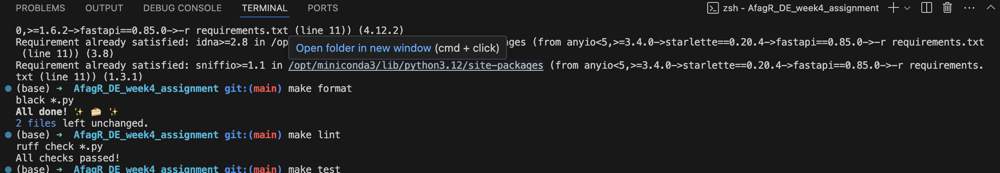
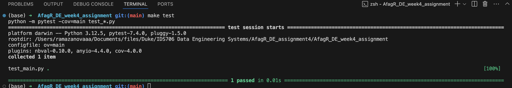
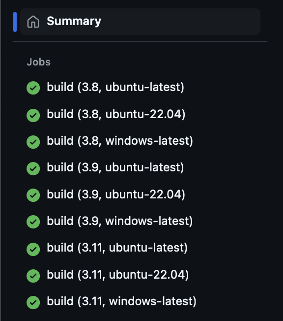

# Overview

This repository demonstrates the use of GitHub Actions to test Python code across multiple versions using a matrix strategy. The workflow is designed to ensure compatibility and functionality of the code with different Python environments.

# Features
- GitHub Actions workflow to run tests across multiple Python versions.
- Matrix build configuration for Python versions [specify the versions you used].

# Usage
- Clone the repository:

- Review the GitHub Actions workflow by navigating to .github/workflows/.
- Push or modify code to trigger the action.
- Check format and test errors

### Formatting and linting

### Testing

### Multiple version runs

